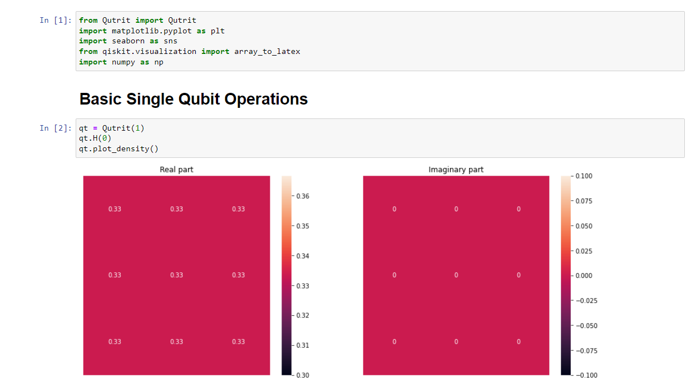
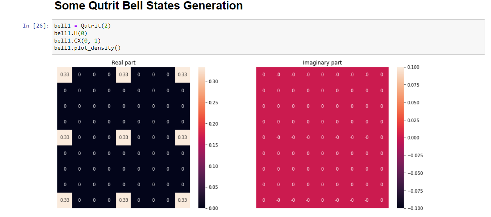
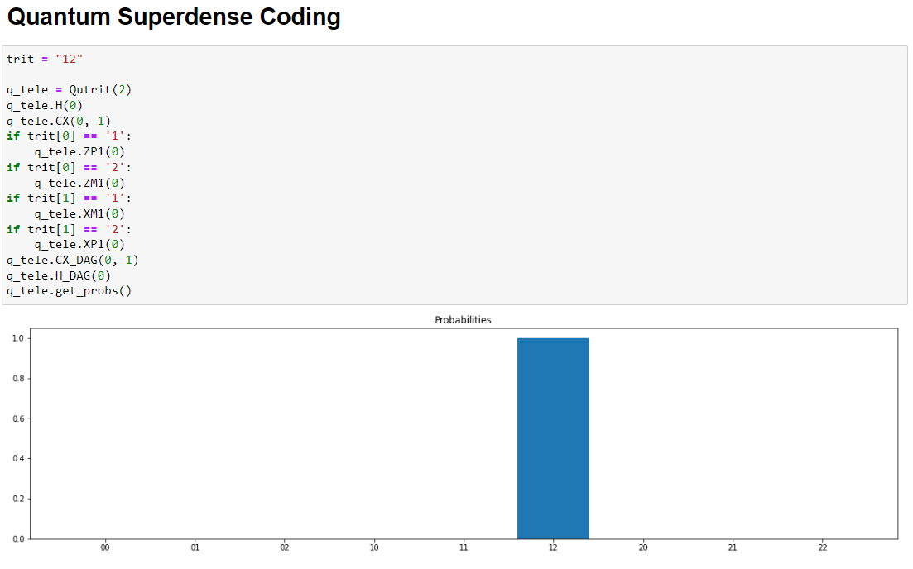

# Qutrit
A simple library mimicking Qiskit to implement very basic Qutrit based circuits. Is constantly in the process of addition and refinement.

To use this library, the prerequisite modules which are to be installed already are:
- numpy
- qiskit
- sqtdiat
- seaborn

Steps to use:
1. Download the "Qutrit.py" file and store it in the folder, where you open your Jupyter Notebooks.
2. Then you can access the library by doing the following import:
  ```from Qutrit import Qutrit```

As of yet the library contains the ternary X gates, H and H_dagger gate, S gate and the Z(omega, omega^2) gate and the Controlled X+1 gate and Controlled X+1_dagger gate.
All the gates were constructed as mentioned in the paper [here](https://arxiv.org/pdf/2204.00552.pdf).

## Note
The code doesnot contain any function which performs measurement of any sort. The code only performs matrix multiplication as of yet, and no simulation of any sort is done.

# Some Basic Examples



